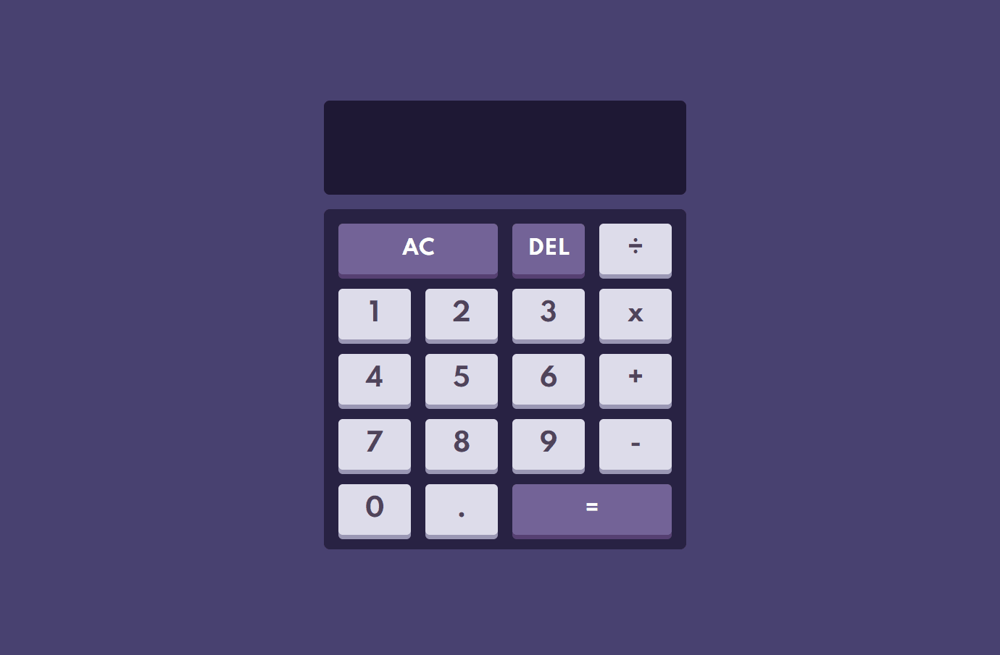

<h1 align="center">Calculadora</h1>

    <a href="#sobre">Sobre</a> | <a href="#conceitos">Conceitos</a> | <a href="#funcionalidades">Funcionalidades</a> | <a href="#tecnologias">Tecnologias</a> | <a href="#aplicação">Aplicação</a>

## <h2 id="sobre">Sobre📖
Esse projeto foi desenvolvido com o intuito de praticar as funções fábrica e o uso do this, e também para o exercício da lógica em JavaScript. 

## <h2 id="conceitos">Conceitos✏️<h2>
Principais conceitos que foram usados no desenvolvimento do projeto:
- HTML Semântico
- Flexbox
- CSS Grid
- Responsividade
- DOM
- Funções Fábrica
- Propriedade hasAttribute

## <h2 id="funcionalidades">Funcionalidades⚙️<h2>
Principais funcionalidades do projeto: 
- [x] Display que mostra a operação atual e a anterior
- [x] Operações Matemáticas com números
- [x] Botão Clear que limpa o display
- [x] Botão Delete que remove o último número
- [x] Formatação de números 

## <h2 id="tecnologias">Tecnologias🛠️<h2>
As seguintes ferramentas foram usadas no desenvolvimento do projeto:
- HTML
- CSS
- JavaScript

## <h2 id="aplicação">Aplicação💻<h2>
Teste a aplicação na sua máquina ou no celular [clicando aqui](https://calculator-math-js.netlify.app) 

Feito com 💙 e ☕ por <a href="https://www.linkedin.com/in/geovani-silva-21298921b/">Geovani Silva</a>
